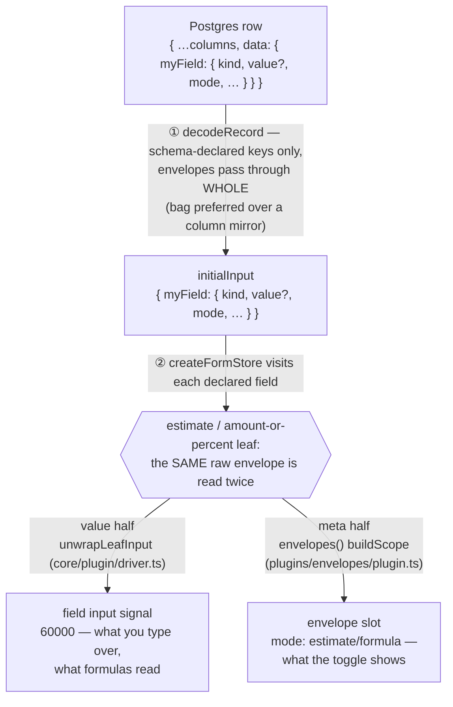

# The decode fork

How a server record becomes form state: **one decode, then a fork** — the
canonical prose lives atop `src/core/codec/decode-record.ts` (the ASCII
version at the point of use); this page is the rendered view.

It is a **fork, not a chain**: the meta reader consumes the original raw,
never the value reader's output, so the value a user sees and the mode state
next to it can never derive from different data.

The same fork re-runs on `reset`, `applyBaseline` (root and per row, after
the value rebase), and array-row reuse — every path funnels through the same
two readers. There is no envelope side-channel: `decodeCompanions` was
deleted in LOS-603 because the envelope rides the field key itself, at every
depth (a row's estimate decodes from its own row object identically).
