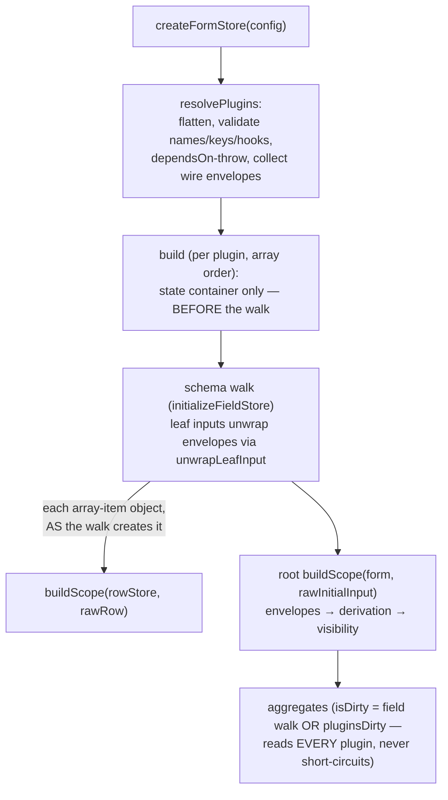

# Plugin lifecycle

Since LOS-603 everything computed on top of the base pipeline is a plugin
(`src/core/plugin/{key,types,driver}.ts`). The standard trio a stage form
registers: `envelopes()` → `derivation(engine)` → `visibility()` — array
order is load-bearing (`derivation` declares `dependsOn: [envelopesKey]`;
a missing/later dependency throws at `createFormStore`).

**Core owns the phases** — every hook is a pinned call site in core; plugins
only order among themselves within a hook.

Later dispatches, each from its pinned core site:

| Hook | Fires from | Purpose |
|---|---|---|
| `reseedScope` | `resetItemState` (row reuse/regrow) | re-seed slots in place — computeds keep tracking |
| `rebase` | `applyBaseline` (root) + `rebaseFieldBaseline` (rows), AFTER the value rebase | baselines adopt fresh meta; live signals only when clean |
| `resetField` | inside `reset`'s walk | restore slots to decode-time baseline (scoped resets free) |
| `syncInput` | `setFieldInput` leaf write | plugin writes `store.input` + its slot (`writeEnvelope`); return true to skip core's write |
| `syncInitial` | `reset({ initialInput })` via `setInitialFieldInput` | re-decode start envelope from the same raw |
| `transferField` / `swapField` | `copyItemState` / `swapItemState` | per-field slots travel with rows (stores are position-fixed) |
| `fieldIsDirty` / `isDirty` | dirty walks / the aggregate | payload emission + Save enablement |
| `encodeValue` | dirty encoding (`getDirtyFieldInput`/`pickDirty`/`encodeScopeValues`) | wrap your own key — the LOS-573 envelope |

State lives in `form.pluginState`, keyed by `PluginKey` identity; per-field
slots (`FieldSlotKey`) are maps keyed by field-store identity. Cross-plugin
reads go through exported keys only (derivation imports `envelopesKey`, never
the envelopes implementation). The react surface reads slots via the same
keys until slice 3 (LOS-604) moves it to `fieldSnapshot` contributions.

Hard rule (spec D6): a plugin's `isDirty` runs inside a computed — it must
read its signals unconditionally, and the aggregate never short-circuits
between plugins; an unran handler contributes no signal reads and deafens the
projection.
