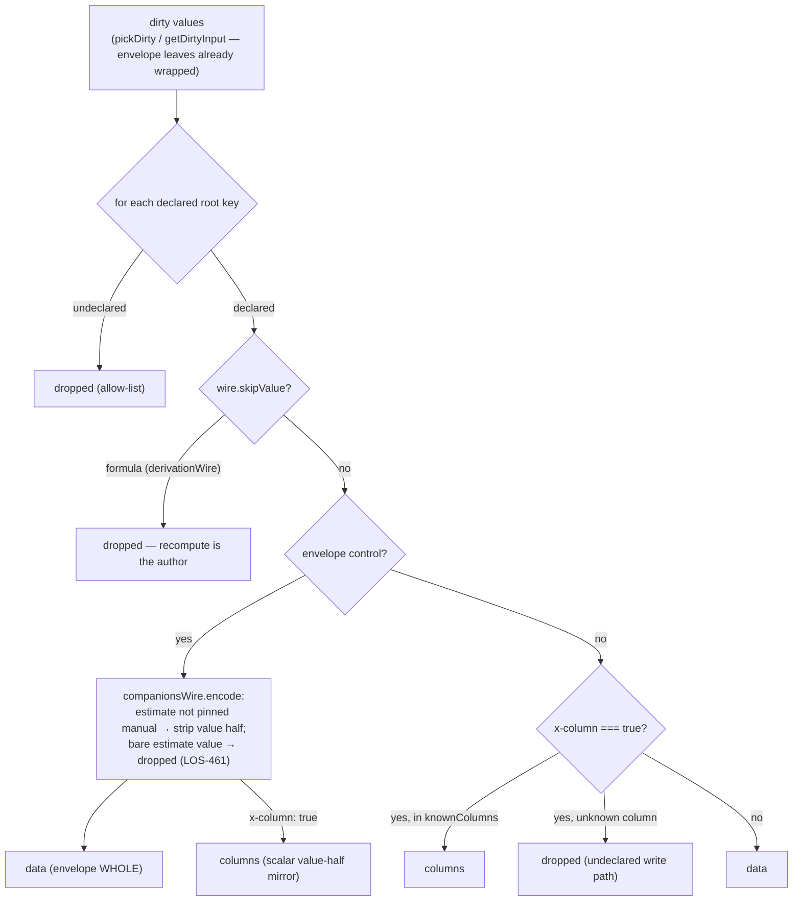

# Wire shapes

Since LOS-573/LOS-603, estimate and amount-or-percent fields persist a **nested
envelope on their own key** — there are no `<key>Source`/`<key>Hybrid` sibling
keys anywhere on the wire:

```jsonc
// estimate (control "estimate", x-field-type "computed")
"totalProjectBudget": {
  "value": 60000,
  "source": { "mode": "manual", "manualValue": 60000, "lastFlippedAt": "…" }
}
// formula-owned: NO value key — the server recompute authors it
"totalProjectBudget": { "source": { "mode": "calculated" } }

// amount-or-percent (control "amount-or-percent", x-field-type "hybrid")
"initialDisbursement": {
  "value": 12500,
  "entry": { "mode": "bps", "denominator": "total_commitment" }
}
```

Inner names stay legacy (`manual`/`calculated`, `bps`/`fixed_amount`). Every
other field persists bare. The shape is owned by ONE static descriptor —
`companionsWire` in `src/plugins/companions/wire.ts` — imported identically by
the client plugin and the server codec (spec D7), so the halves cannot drift.

## Encode: `encodeDirty(schema, dirty, { knownColumns, wire })`



Key rules:

- **The envelope is one bag key.** Partial writes clobber the other half, so
  every emission is a COMPLETE envelope; whole-array posts wrap every
  estimate/hybrid row leaf, dirty or not (`encodeScopeValues`).
- **Column-backed envelope fields**: the bag holds the envelope (source of
  truth); the column gets a mirrored scalar for SQL/list pages. Decode prefers
  the bag.
- The LOS-461 policy is unchanged, relocated: a formula value is always
  server-recomputed; an estimate value persists exactly when its meta pins
  `mode: "manual"`.

## Decode

`decodeRecord(schema, record, { envelopes })` routes by `x-column` and passes
envelopes through whole; the walk unwraps the value half at each leaf
(`unwrapLeafInput`) and the companions plugin takes the meta half — see the
fork diagram atop `src/core/codec/decode-record.ts` and
[decode-fork.md](./decode-fork.md).
